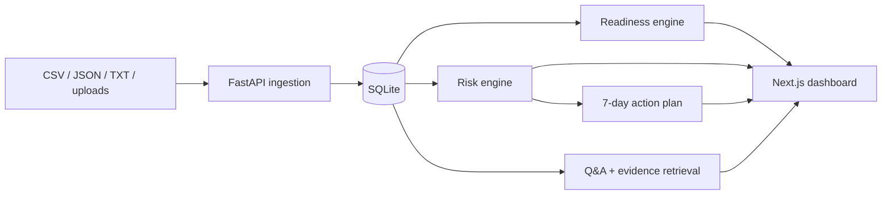

# Flowlie Raise Readiness Copilot

A zero-budget, local-first full-stack prototype: an **internal operator workbench / evidence-intake console** that turns founder-provided back-office data into auditable, source-backed diligence-preparation drafts for human review.

> **Positioning:** This is not intended to replace Flowlie's embedded team model. It is a prototype operator workbench showing how founder-provided evidence can be transformed into auditable diligence preparation drafts for human review. All generated output is a draft marked **needs operator review** and does not provide legal, tax, investment, accounting, or financial advice.

## V1.2: Operator Console and Multi-Company Evidence Intake

V1.2 reframes the product as an **Operator Console** for an embedded back-office team and expands the original AtlasAI demo into a persistent, multi-company evidence-intake workspace. An operator reviews founder-provided evidence, identifies diligence gaps, generates source-backed preparation notes, and assigns cleanup work.

Every generated output — readiness score, risks, investor Q&A, action items, and the exported report — carries a `review_status` of `draft | needs_review | reviewed` and **defaults to `needs_review`**. The portfolio surfaces this review status per company, and an operator can promote a company's analysis to `reviewed` through `PATCH /companies/{id}/readiness/review`.

What V1.2 adds:

- Five synthetic startups: AtlasAI, FinPilot, HealthSync, DevToolsHub, and GreenLedger
- A `/companies` portfolio comparing scores, tiers, top risks, and open actions
- A guided `/companies/new` workflow for arbitrary startups
- Dashboard forms for financials, cap table, headcount, pipeline, compliance, and documents
- SQLite-backed create, edit, and delete operations
- Company-specific dashboards, analysis runs, and Markdown reports
- Graceful partial analysis when required evidence has not been added yet

The four comparison-company scores use documented seed-time portfolio calibration targets from the product brief. Component scores, risks, Q&A, and action plans remain deterministic and are generated from each company’s own synthetic records.

The included synthetic company, **AtlasAI**, is a Seed-stage AI sales automation startup. Flowlie analyzes its financials, data room, compliance checklist, cap table, headcount, customer pipeline, and investor meeting notes to produce:

- A weighted **Strict Raise Readiness Score** and readiness tier
- An evidence-backed Recovery Path with estimated score lift by action
- A Seed data-room checklist
- Runway, burn, growth, and margin insights
- Evidence-backed risk flags
- Investor diligence questions with suggested answers and named sources
- A seven-day founder action plan

No paid APIs, external investor databases, or real company data are required.

## Why this matters

Fundraising preparation is usually fragmented across spreadsheets, folders, legal checklists, and founder memory. The Copilot creates a single preparation layer: it identifies the gaps likely to create investor follow-ups, shows the evidence behind every claim, and converts those gaps into owned work.

> This project is a prototype for portfolio and product demonstration purposes only.
> It does not provide legal, tax, investment, accounting, or financial advice.
> All demo data is synthetic.

## Product preview

Run the app locally, open `http://localhost:3000/demo`, and select **Seed & analyze AtlasAI**. The dashboard will populate in one workflow.

### Strict score and recovery path


### Investor-facing risk context


### Source-backed diligence Q&A


## Architecture



The system is deliberately deterministic. Keyword classification, explicit scoring rules, templated Q&A, and document-snippet retrieval make the prototype testable and auditable without an LLM dependency.

## Tech stack

- Frontend: Next.js 16, React 19, TypeScript, Tailwind CSS, Recharts, Lucide icons
- Backend: FastAPI, SQLAlchemy, Pydantic, SQLite
- File parsing: PyMuPDF, python-docx, openpyxl
- Testing: pytest and a production Next.js build/type check

## Repository map

```text
apps/web/                 Next.js product UI
services/api/app/         FastAPI routes, models, and engines
services/api/tests/       Unit and end-to-end API tests
demo-data/                Synthetic AtlasAI evidence
docs/                     Architecture, product memo, roadmap, demo script
```

## Local setup

### 1. Backend

Windows PowerShell:

```powershell
cd services/api
python -m venv .venv
.\.venv\Scripts\Activate.ps1
pip install -r requirements.txt
uvicorn app.main:app --reload --port 8000
```

macOS/Linux:

```bash
cd services/api
python -m venv .venv
source .venv/bin/activate
pip install -r requirements.txt
uvicorn app.main:app --reload --port 8000
```

API docs: `http://localhost:8000/docs`

### 2. Frontend

In a second terminal:

```bash
cd apps/web
npm install
npm run dev
```

Open `http://localhost:3000`.

To point the UI at a different API:

```bash
NEXT_PUBLIC_API_URL=http://localhost:8000
```

### 3. Run the demo via API

```bash
curl -X POST http://localhost:8000/demo/seed
curl -X POST http://localhost:8000/companies/1/risks/generate
curl -X POST http://localhost:8000/companies/1/investor-qa/generate
curl -X POST http://localhost:8000/companies/1/readiness/run
curl -X POST http://localhost:8000/companies/1/action-plan/generate
```

The `/demo` UI performs the same sequence with one button.

## API overview

| Area | Endpoints |
| --- | --- |
| Demo | `POST /demo/seed`, `POST /demo/reset`, `GET /demo/status` |
| Multi-company demo | `POST /demo/seed-atlasai`, `POST /demo/seed-all` |
| Company | `POST /companies`, `GET /companies`, `GET /companies/{id}`, `GET /companies/{id}/dashboard` |
| Portfolio | `GET /companies/summary` |
| User data | CRUD routes for financials, cap table, headcount, pipeline, compliance, and documents |
| Recovery and export | `GET /companies/{id}/recovery-path`, `GET /companies/{id}/diligence-report.md` |
| Documents | upload, list, analyze, and data-room checklist routes |
| Financials | monthly series and summary routes |
| Readiness | run analysis, retrieve latest score, and `PATCH /companies/{id}/readiness/review` to set operator review status |
| Risks | generate, list, and update status |
| Investor Q&A | generate/list questions and search source evidence |
| Action plan | generate/list seven-day tasks |

## Scoring logic

The overall score is the required weighted formula:

```text
Finance 25% + Data room 25% + Compliance 20% +
Cap table 15% + Pipeline 10% + Meeting follow-up 5%
```

Each component begins at 100 (except data-room completeness, which is a document ratio) and receives the deductions described in `readiness_engine.py`.

### AtlasAI score calibration note

The product brief contains an internal numerical conflict. Its requested AtlasAI target is 70–80, but applying every specified deduction exactly produces:

| Component | Score |
| --- | ---: |
| Finance | 50.0 |
| Data room | 61.5 |
| Compliance | 25.0 |
| Cap table | 80.0 |
| Pipeline | 60.0 |
| Meeting follow-up after Q&A | 50.0 |
| **Weighted overall** | **53.4** |

This implementation keeps the explicit rules and displays the honest result as the **Strict Raise Readiness Score**. AtlasAI’s tier is **Not diligence-ready**.

The Recovery Path is calculated separately. Completing signed contractor IP assignments, 409A and BOI evidence, a detailed use-of-funds document, and a modeled SAFE removes 25.6 weighted penalty points. That creates a 79.0 point estimate and a displayed review range of **78–84**. The customer-concentration memo is marked “preparedness only” because documentation does not change the underlying concentration metric.

## Risk logic

Risk generation is deterministic and idempotent. AtlasAI triggers flags for short runway, gross-margin decline, burn growth, unsigned contractor IP, missing 409A and BOI evidence, state qualification review, an unmodeled SAFE, customer concentration, and missing use-of-funds detail. Each flag contains:

- Evidence from the synthetic source records
- Potential business impact
- Why the issue matters to investors
- A founder-oriented suggested fix
- Severity and workflow status

## Source-backed Q&A

The Q&A engine uses calculated metrics and templates. It never invents a missing document or claims a legal conclusion. Each answer includes source filenames, a confidence value, and an explicit `missing_evidence` field. A lightweight search endpoint retrieves relevant snippets by keyword overlap.

## Tests

Backend:

```powershell
cd services/api
.\.venv\Scripts\python -m pytest
```

Frontend:

```bash
cd apps/web
npm run typecheck
npm run build
```

## Demo data

`demo-data/` contains the complete synthetic AtlasAI profile and evidence set. The files intentionally include realistic diligence gaps: 7.1 months of runway, margin compression, rising burn, unsigned contractor IP, incomplete compliance evidence, an unmodeled SAFE, customer concentration, and a missing detailed use-of-funds plan.

## Product narrative

- [Flowlie outreach brief](docs/FLOWLIE_OUTREACH.md)
- [Portfolio case study](docs/CASE_STUDY.md)
- [Three-minute demo script](docs/DEMO_SCRIPT.md)

## Future roadmap

See [docs/ROADMAP.md](docs/ROADMAP.md). Likely next steps include optional local Ollama answer refinement, document versioning, scenario planning, investor-specific diligence packs, and a dilution simulator.
