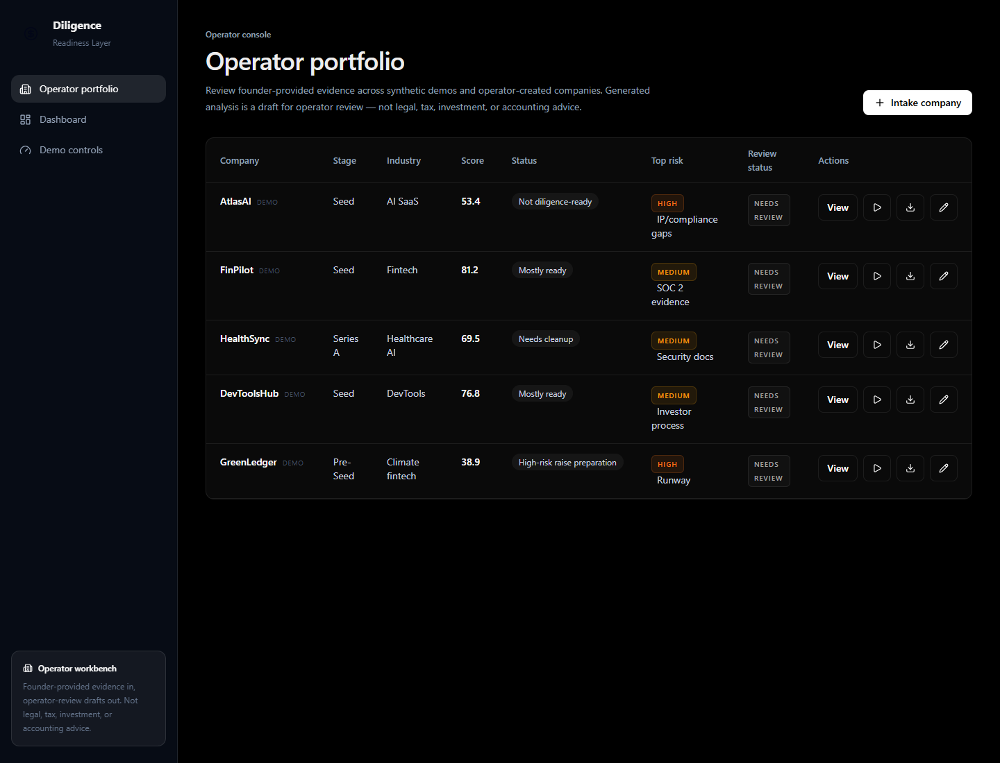
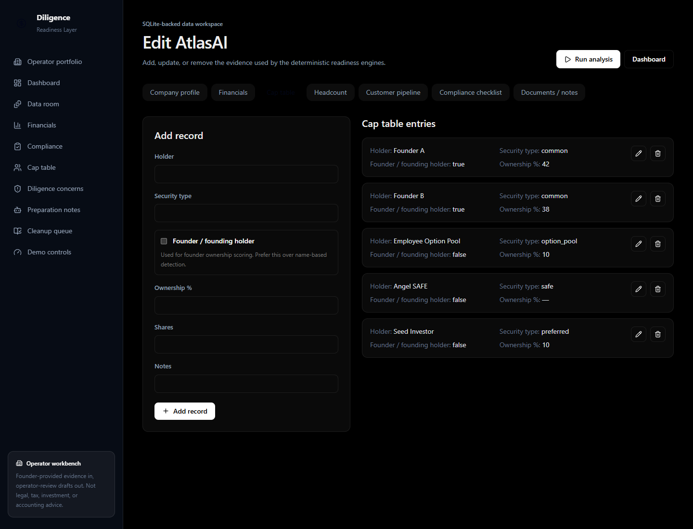
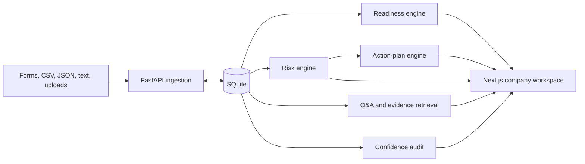

# Diligence Readiness Layer

An independent feature-layer prototype for operator-reviewed fundraising diligence preparation.

**Release candidate:** `0.4.0`

> This is an independent prototype. It is not a standalone company or product, is not affiliated with or endorsed by any company, and does not provide legal, tax, accounting, investment, or fundraising advice. Generated outputs are drafts requiring human review.

## What it does

The application turns founder-provided operating evidence into a transparent preparation workflow:

- a Strict Raise Readiness Score with a visible tier;
- an evidence-backed recovery path and estimated score lift;
- financial runway, burn, growth, and margin analysis;
- data-room, compliance, ownership, people, pipeline, and meeting-evidence review;
- deterministic risk flags with investor relevance;
- source-backed investor preparation Q&A;
- a seven-day cleanup queue;
- a downloadable Markdown diligence report;
- a six-component confidence audit that exposes incomplete or unreviewed evidence.

All analysis runs locally using rules, templates, keyword classification, and SQLite. No paid APIs are required.

## Product preview

### Multi-company operator portfolio



### AtlasAI strict score and recovery path


### Source-backed diligence concerns


### Investor preparation notes


### Confidence audit


### SQLite-backed evidence intake



## Demo companies

| Company | Stage | Industry | Demo score | Tier |
| --- | --- | --- | ---: | --- |
| AtlasAI | Seed | AI SaaS | 53.4 | Not diligence-ready |
| FinPilot | Seed | Fintech | 81.2 | Mostly ready |
| HealthSync | Series A | Healthcare AI | 69.5 | Needs cleanup |
| DevToolsHub | Seed | DevTools | 76.8 | Mostly ready |
| GreenLedger | Pre-Seed | Climate fintech | 38.9 | High-risk raise preparation |

The comparison scores are documented demo calibration snapshots. Component scores and all user-company analysis remain deterministic.

## Architecture



See [docs/ARCHITECTURE.md](docs/ARCHITECTURE.md) for implementation details.

## Repository map

```text
apps/web/                  Next.js App Router frontend
services/api/app/          FastAPI routes, models, and deterministic engines
services/api/tests/        Isolated SQLite backend tests
demo-data/                 Five synthetic startups plus stress fixtures
docs/                      Architecture, limitations, case study, outreach, and demo notes
```

## Local setup

### Backend

```powershell
cd services/api
python -m venv .venv
.\.venv\Scripts\Activate.ps1
pip install -r requirements.txt
uvicorn app.main:app --reload --port 8000
```

API documentation is available at `http://localhost:8000/docs`.

### Frontend

```powershell
cd apps/web
npm install
npm run dev
```

Open `http://localhost:3000/demo`, seed all companies, then open the operator portfolio.

Set a different API origin when needed:

```powershell
$env:NEXT_PUBLIC_API_URL="http://localhost:8000"
npm run dev
```

## Verification

Backend:

```powershell
cd services/api
.\.venv\Scripts\python -m pytest -v
```

Tests use a temporary SQLite file and do not modify `services/api/f.db`.

Frontend:

```powershell
cd apps/web
npm run typecheck
npm run build
npm audit
```

`typecheck` runs TypeScript with `tsc --noEmit`. ESLint and browser-test coverage are not currently configured; Playwright is installed for screenshot/demo automation only.

## Human-review model

Generated scores, risks, Q&A, action items, and reports default to `needs_review`. Unknown documents remain visible and are not treated as strong evidence. An operator can promote an analysis to `reviewed` after checking the underlying records.

## Documentation

- [Demo script](docs/DEMO_SCRIPT.md)
- [Portfolio case study](docs/CASE_STUDY.md)
- [Architecture](docs/ARCHITECTURE.md)
- [Limitations](docs/LIMITATIONS.md)
- [Stress test](docs/STRESS_TEST.md)
- [Engineering lessons](docs/ENGINEERING_LESSONS.md)
- [Roadmap](docs/ROADMAP.md)
- [Private Flowlie-aware outreach note](docs/FLOWLIE_OUTREACH.md)
