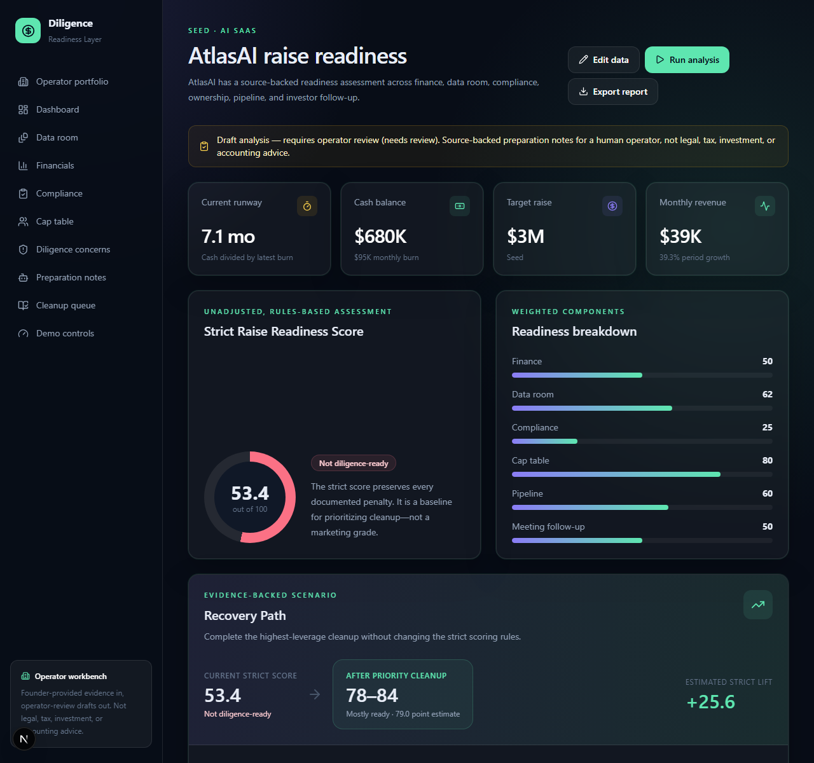
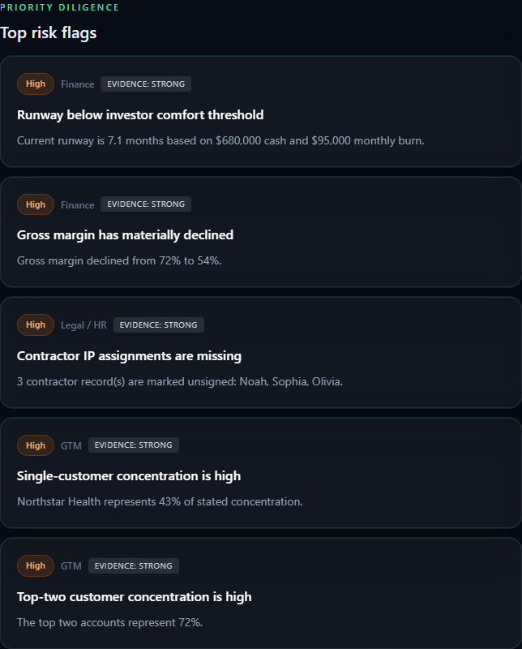
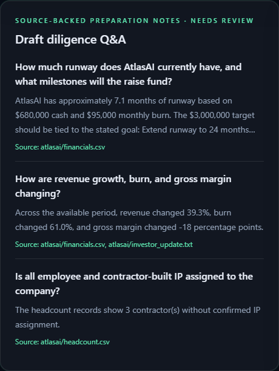
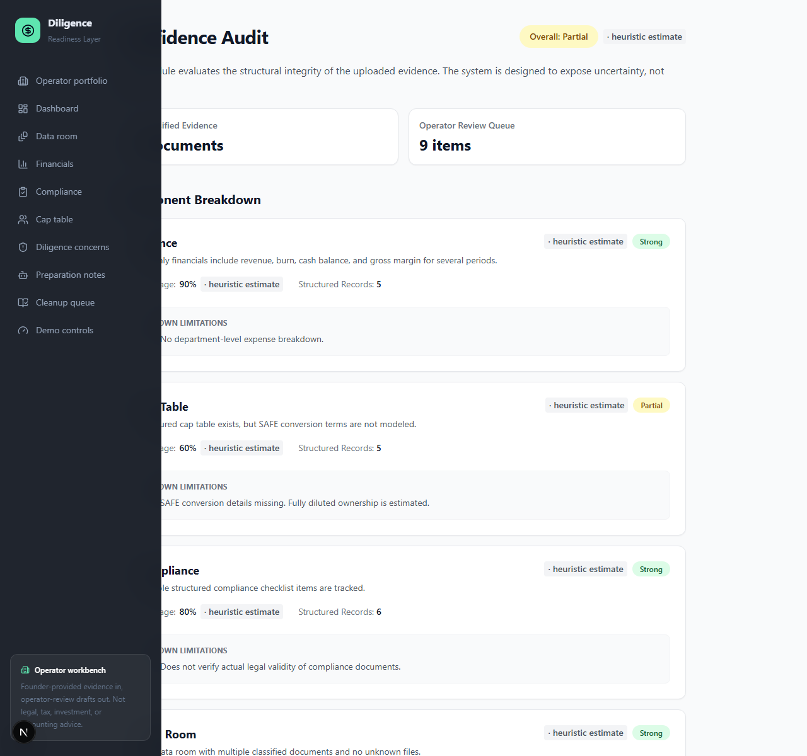
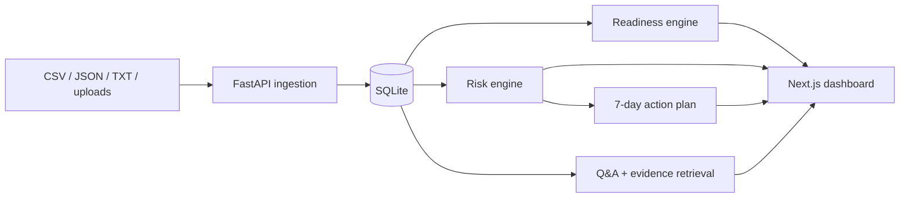

# Diligence Readiness Layer

Diligence Readiness Layer is an operator-reviewed evidence intelligence module for fundraising preparation.

> **Disclaimer:** This is an independent feature prototype, not a standalone company/product and not affiliated with or endorsed by any company. It explores how an embedded operator team could turn founder-provided evidence into draft diligence-preparation artifacts for human review. It does not provide legal, tax, accounting, investment, or fundraising advice.

## Why this exists

Fundraising preparation is usually fragmented across spreadsheets, folders, legal checklists, and founder memory. This intelligence layer creates a single preparation workflow: it identifies the gaps likely to create investor follow-ups, shows the evidence behind every claim, and converts those gaps into a draft cleanup queue for human review.

## Why this is a feature layer, not a standalone product

Founders should not rely on the system alone. Generated outputs are drafts, and operators must review and promote them. The system supports an embedded team by reducing evidence fragmentation. The value is trust, source traceability, and a clear cleanup workflow, not automatic judgment.

## What it demonstrates

This is a prototype showing how founder-provided evidence can be transformed into auditable diligence preparation drafts. It demonstrates engineering judgment, strict rule-based scoring, and the transition of a generic demo into a persistent, multi-company evidence workspace. It uses deterministic keyword classification, explicit scoring rules, templated Q&A, and document-snippet retrieval to make the prototype testable and auditable without an LLM dependency.

## What this does not do

* It is not a standalone product or founder self-serve platform.
* It does not provide autonomous legal/compliance review.
* It does not deeply understand arbitrary legal/financial documents.
* It does not replace operator judgment.
* It does not make legal, tax, accounting, investment, or fundraising determinations.
* It does not predict investor behavior or prove a company is ready to raise.
* It does not handle production security, permissions, audit, encryption, or document versioning.

## What it does not claim

This tool is not claiming to replicate any company’s product or internal tooling. It does not provide legal, tax, investment, accounting, or financial advice. It is not an autonomous compliance engine; all generated outputs are explicitly drafts requiring operator review.

## Demo companies

The application includes five synthetic startups: AtlasAI, FinPilot, HealthSync, DevToolsHub, and GreenLedger. A `/companies` portfolio allows comparing scores, tiers, top risks, and open actions. The included synthetic company, AtlasAI, is a Seed-stage AI sales automation startup. The console analyzes its financials, data room, compliance checklist, cap table, headcount, customer pipeline, and investor meeting notes to produce diligence drafts. No paid APIs, external investor databases, or real company data are required.

## Human review workflow

Every generated output — readiness score, risks, investor Q&A, action items, and the exported report — carries a `review_status` of `draft | needs_review | reviewed` and defaults to `needs_review`. An operator can promote a company's analysis to `reviewed` after verifying the drafts. If a document cannot be confidently classified, it is marked as `unknown` and requires human review, bypassing automated strong scoring.

## Limitations

* Rule-based scoring is not calibrated on real financing outcomes.
* Keyword classification does not deeply understand arbitrary legal, financial, or cap-table documents.
* Real PDFs, scans, OCR errors, unusual cap tables, and ambiguous compliance documents require human review.
* The system produces drafts, not determinations.
* The recovery score is a projection based on explicit rule removal, not a prediction of investor behavior.
* The app does not provide legal, tax, accounting, investment, or fundraising advice.
* Production use would require security, access control, audit logs, encryption, document versioning, reviewer workflows, and expert validation.

For more context, see [LIMITATIONS.md](docs/LIMITATIONS.md) and [ENGINEERING_LESSONS.md](docs/ENGINEERING_LESSONS.md).

## Product preview

Run the app locally, open `http://localhost:3000/demo`, and select Seed & analyze AtlasAI. The dashboard will populate in one workflow.

### Strict score and recovery path



### Investor-facing risk context



### Source-backed diligence Q&A



### Confidence Audit



## Architecture



## Tech stack

- Frontend: Next.js 16, React 19, TypeScript, Tailwind CSS, Recharts, Lucide icons
- Backend: FastAPI, SQLAlchemy, Pydantic, SQLite
- File parsing: PyMuPDF, python-docx, openpyxl
- Testing: pytest and a production Next.js build/type check

## Repository map

```text
apps/web/                 Next.js product UI
services/api/app/         FastAPI routes, models, and engines
services/api/tests/       Unit and end-to-end API tests
demo-data/                Synthetic AtlasAI evidence
docs/                     Architecture, product memo, roadmap, demo script
```

## Local setup

### 1. Backend

Windows PowerShell:

```powershell
cd services/api
python -m venv .venv
.\.venv\Scripts\Activate.ps1
pip install -r requirements.txt
uvicorn app.main:app --reload --port 8000
```

macOS/Linux:

```bash
cd services/api
python -m venv .venv
source .venv/bin/activate
pip install -r requirements.txt
uvicorn app.main:app --reload --port 8000
```

API docs: `http://localhost:8000/docs`

### 2. Frontend

In a second terminal:

```bash
cd apps/web
npm install
npm run dev
```

Open `http://localhost:3000`.

To point the UI at a different API:

```bash
NEXT_PUBLIC_API_URL=http://localhost:8000
```

### 3. Run the demo via API

```bash
curl -X POST http://localhost:8000/demo/seed
curl -X POST http://localhost:8000/companies/1/risks/generate
curl -X POST http://localhost:8000/companies/1/investor-qa/generate
curl -X POST http://localhost:8000/companies/1/readiness/run
curl -X POST http://localhost:8000/companies/1/action-plan/generate
```

The `/demo` UI performs the same sequence with one button.

## Tests

Backend:

```powershell
cd services/api
.\.venv\Scripts\python -m pytest
```

Frontend:

```bash
cd apps/web
npm run typecheck
npm run build
```

## Demo data

`demo-data/` contains the complete synthetic AtlasAI profile and evidence set. The files intentionally include realistic diligence gaps: 7.1 months of runway, margin compression, rising burn, unsigned contractor IP, incomplete compliance evidence, an unmodeled SAFE, customer concentration, and a missing detailed use-of-funds plan.

## Future roadmap

See [docs/ROADMAP.md](docs/ROADMAP.md). Likely next steps include optional local Ollama answer refinement, document versioning, scenario planning, investor-specific diligence packs, and a dilution simulator.
