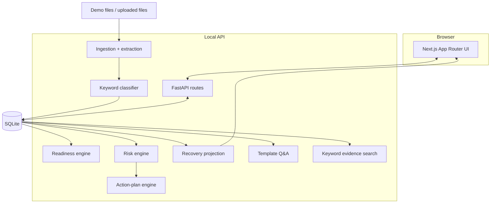

# Architecture

## System overview

Flowlie is a local monorepo with a Next.js frontend and a FastAPI service backed by SQLite.

## Frontend/backend separation

The UI is a client of the JSON API and contains no scoring logic. `NEXT_PUBLIC_API_URL` controls the service location. Reusable dashboard components handle score, metric, badge, risk, and empty-state presentation.

FastAPI owns persistence, file ingestion, deterministic analysis, and source attribution. CORS is restricted to local frontend origins by default.

## Database models

The relational model covers Company, Document, FinancialMetric, CapTableEntry, HeadcountRecord, CustomerPipelineRecord, ComplianceItem, ReadinessScore, RiskFlag, InvestorQuestion, and ActionItem. Generated entities are stored so the product can show an analysis snapshot instead of recalculating on every page load.

## Analysis engines

### Scoring

`readiness_engine.py` calculates six 0–100 component scores and applies the specified weights. Every deduction is transparent and unit tested.

### Risk generation

`risk_engine.py` evaluates explicit conditions and creates structured flags. Generation routes replace prior generated flags, making reruns deterministic and preventing duplicates.

### Q&A

`qa_engine.py` turns computed facts and known gaps into ten founder preparation questions. Answers are templates populated with metrics and evidence—not freeform model output.

### Search

`search_engine.py` tokenizes the query and extracted document text, ranks keyword overlap, and returns short source snippets. It is intentionally simple enough to inspect and can later be replaced by SQLite FTS5 or TF-IDF.

### Action planning

`action_plan_engine.py` maps the known AtlasAI risk classes into a seven-day sequence with owner, priority, due date, category, status, and estimated strict-score lift.

### Recovery projection

`recovery_engine.py` removes only the weighted penalties directly addressed by specified cleanup evidence. For AtlasAI, that produces a 79.0 point estimate and a 78–84 review range. Preparedness documents that do not alter an underlying metric receive zero strict-score lift.

### Markdown report

The report engine assembles the latest stored analysis, source inventory, recovery math, risks, Q&A, and action plan into a downloadable Markdown artifact.

## File ingestion

Uploads support TXT/Markdown, JSON, CSV, PDF, DOCX, and XLSX. The extractor converts each format to text, then the classifier assigns a type, category, confidence, and matched keywords.

## Zero-budget AI strategy

The prototype treats “AI” as an orchestration pattern rather than an API dependency:

1. Extract and normalize evidence.
2. Classify with observable keyword matches.
3. Calculate facts with deterministic functions.
4. Generate risks from explicit conditions.
5. Populate answer templates only from available facts.
6. Attach named sources and missing-evidence statements.
7. Convert risk classes into owned tasks.

This produces predictable demos, supports tests, and avoids hallucinated claims.

## Production evolution

SQLite can move to PostgreSQL; keyword retrieval can move to FTS5, TF-IDF, or pgvector; and optional local Ollama output can rewrite already-grounded answers. The rule results should remain the source of truth even if a language model is added.
