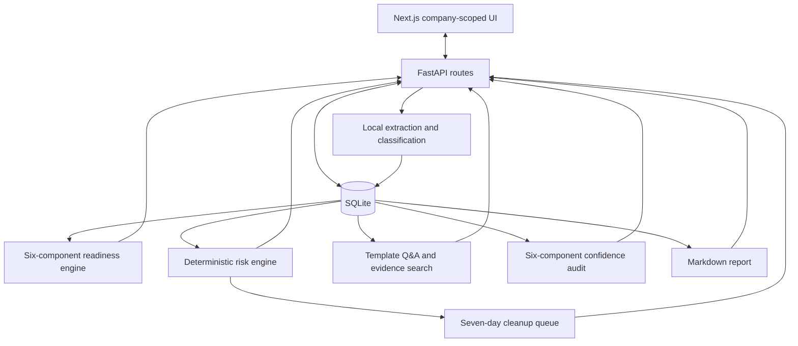

# Architecture

## Positioning

Diligence Readiness Layer is an independent feature-layer prototype for operator-reviewed fundraising diligence preparation. It is not positioned as a standalone company, an autonomous adviser, or an endorsed extension of another product.

## Runtime

- Next.js 16 and React 19 provide the company portfolio and evidence workspace.
- FastAPI owns validation, persistence, extraction, and analysis.
- SQLite stores demo and user-entered company data.
- PyMuPDF, python-docx, and openpyxl extract supported local files.
- No paid API or hosted model is required.

## Company routing

Company-specific views live under `/companies/[id]/...`. The sidebar derives links from the active company ID. Legacy top-level section URLs redirect to the company portfolio instead of silently reading company `1`.

## Data model

Every financial, cap-table, headcount, pipeline, compliance, document, score, risk, question, and action record carries a `company_id`.

`Company.is_demo` is the sole deletion marker used by demo reset. A user company is never deleted because its name resembles a synthetic demo.

Cap-table founder ownership uses the explicit `is_founder` field. Holder-name matching is retained only in synthetic seed import, where the fixture convention is controlled.

## Analysis

The strict score combines six deterministic components:

| Component | Weight |
| --- | ---: |
| Finance | 25% |
| Data room | 25% |
| Compliance | 20% |
| Cap table | 15% |
| Pipeline | 10% |
| Meeting follow-up | 5% |

Risk rules evaluate explicit financial, ownership, people, compliance, commercial, fundraising, and industry conditions. Q&A templates use calculated facts and named source files. Recovery projections remove only documented weighted penalties.

## Confidence audit

The confidence audit mirrors all six readiness components. It reports `strong`, `partial`, `weak`, or `unknown` using observable coverage rules. These labels are heuristic workflow signals, not statistical probabilities.

## Test isolation

Pytest sets `DATABASE_URL` before importing the application. The suite creates a unique temporary SQLite file, recreates tables for each test, and deletes the file at session end. FastAPI lifespan startup and route dependencies therefore never touch the developer database.

## Production boundaries

Production use would require identity and organization isolation, authorization, encryption, audit logs, document versioning, background jobs, reviewer assignments, migration tooling, OCR, and domain-expert validation.
